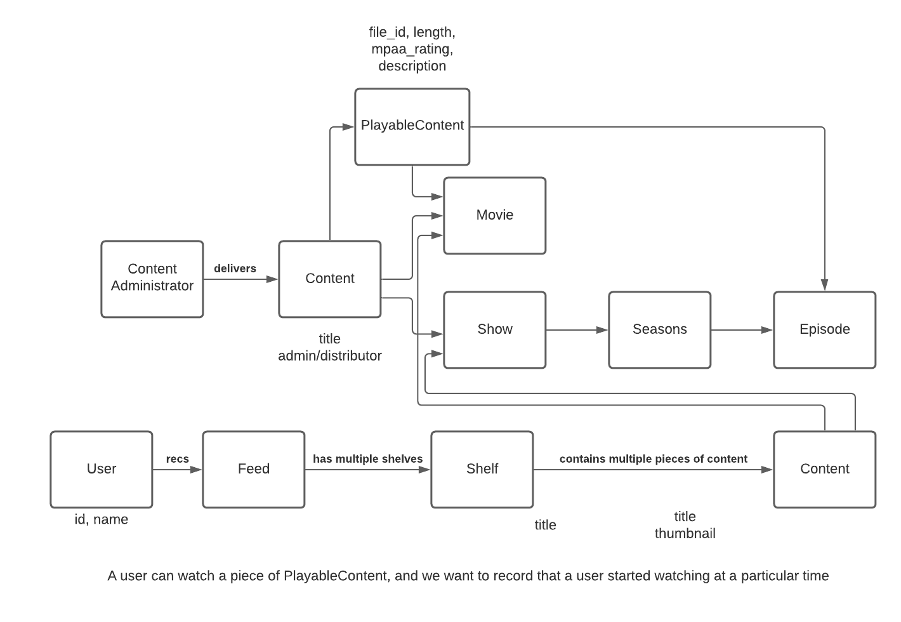

# coopflix

Basic Netflix clone to serve as an example for modeling ECE366 projects and getting a feel for basic code hierarchy/architecture.

## Basic system diagram



**Basic system diagram. In class, we mainly covered `User`, `Feed`, `Shelf`, `Content`, and `Movie`.**

## In Class

The overall flow that we followed can be adapted for your own projects:

1. Domain modeling
1. Create model classes or interfaces.
1. Create stores for base models and pre-populate a few examples.
1. Create services classes to fetch/update models and use base models to derive other models. (e.g. a `User`'s stored preferences and filtered `Content` items allow you to determine a `Feed`.)
1. Wire up the API, delegate to the services and stores.

Note that we followed a sort of bottom-up approach, but you can alternatively define your API and work your way down. Or use a hybrid of the two approaches and meet in the middle somewhere in the service/business logic layer. Making the distinction of in what direction you're working and thinking helps you and your group to stay on the same page and communicate more effectively.

### Domain modeling

Start by brainstorming and diagramming your model. What objects are you modeling? How do they relate to one another? What actions can be taken on various models? Which models are base models, and which are derived? For example, a `User` and a `Movie` can be stored in your database/hashmap. But you might derive a `Feed` or `Shelf` which showcases `Content` that might be of interest to a particular `User`. (Note: the real Netflix ecosystem is probably much more complicated, involving ML models and more services which pre-compute your feed/home screen/etc. However, for illustrative purposes, we're starting small by building one system.)

### Create model classes or interfaces

I like to use [AutoMatter](https://github.com/danielnorberg/auto-matter), which is a simple library which provides value/builder classes for your models. It makes it easy to convert to and from a serialized representation, such as JSON or binary.

You can make use of inheritance to encapsulate that different models share the same metadata. Alternatively, you can replicate fields across different content types. The point is that in some cases, you want to make use of type structures to be able to use things more generically. Play around and experiment with the code. Don't be afraid to change things around and pivot.

### Create store interfaces and implementations

Now that you have some models defined, create store interfaces and implementations. Use the IDE (Alt/Opt+Enter, Ctrl+T, etc) to get faster at having it work for you! You can create constructors, bind new constructor parameters to class fields, rename variables and methods and classes, etc.

Populate your store implementations with some sample data, and consider implementing it as a `HashMap` or using a `List` and iterating over all the content.

### Create service classes

You've got the stores, now let's figure out the core logic. What can you derive based on what models you have stored? Maybe you're creating a lobby for your game or deriving a personalized feed. You don't need to nail this right now, but you should have some rudimentary way to implement a basic algorithm. In class, we created a `Feed` by taking a `User`'s preferred genres and creating one `Shelf` per `Genre`.

For more simple operations that are "pass-through" to get or save something to or from the store, you can still do that through the service layer.

### Wire up the API

In your top-level `Main`, `Server`, or `App` class (i.e. the class where you're running your Spark server), you should instantiate all of your dependencies and wire them up. In general, you'll define your API endpoints (i.e. get/post/put/delete) in this class and have them call methods in a `Handler` class. In turn, that `Handler` class usually depends upon one or more `Service` classes and/or `Store` classes. Then, your `Service` classes may depend on `Store` classes and other `Service` classes in some cases. The important thing is to avoid scenarios where circular dependencies arise, i.e. A depends on B depends on C depends on A.

At the API layer, you have to define how you will transform your model state to a serialized format for requests and vise versa when the client will create new model objects. I chose Google's `gson` library here because of its simplicity and compatibility with AutoMatter.

If all goes well, you should be able to `mvn clean compile` and run your application from the main class. Use `curl` or a basic HTTP client to make calls to it.

From class, here are the commands I ran:

```bash
# confirm that the server is up
$ curl -s localhost:4567/ping
OK%

# get user 1
$ curl -s localhost:4567/user/1 | jq
{
  "id": "1",
  "name": "horror dude",
  "subscription": {},
  "preferredGenres": [
    "HORROR"
  ]
}

# get user 1's feed, pipe through jq to see pretty output
$ curl -s localhost:4567/user/1/feed | jq
{
  "shelves": [
    {
      "title": "because your partner doesn't appreciate being scared",
      "shelfItems": [
        {
          "id": "4",
          "title": "Scream",
          "thumbnail": {},
          "distributorId": {},
          "genre": "HORROR",
          "rating": {},
          "fileId": {},
          "length": {},
          "description": {}
        },
        {
          "id": "5",
          "title": "Scream 2",
          "thumbnail": {},
          "distributorId": {},
          "genre": "HORROR",
          "rating": {},
          "fileId": {},
          "length": {},
          "description": {}
        },
        {
          "id": "6",
          "title": "Scream 3",
          "thumbnail": {},
          "distributorId": {},
          "genre": "HORROR",
          "rating": {},
          "fileId": {},
          "length": {},
          "description": {}
        }
      ]
    }
  ]
}
```
